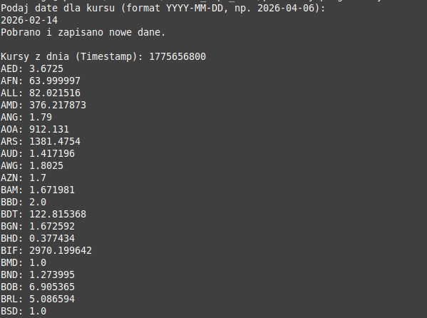

# Aplikacja bazodanowa

Aplikacja konsolowa pobierające historyczne dane z [Open Exchange Rates](https://openexchangerates.org) na podstawie podanej daty. Dane zapisywane są w bazie danych, ale tylko jeśli już ich w niej nie ma.

