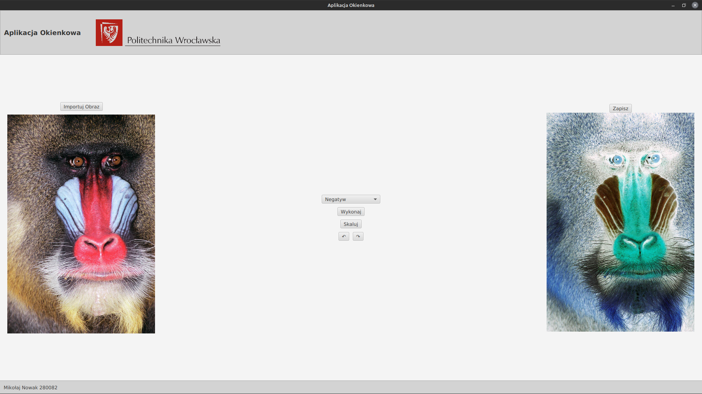

# Wielowątkowość i GUI w Java

Wykonano aplikcaje okienkową umożliwiającą wczytanie obrazu, wyświetlenie oraz jego zapis. Dodano do aplikacji 4 opcje przetwarzania obrazu: przekształcenie na negtyw, progowanie, wyszukanie konturów, skalowanie oraz obracanie.

