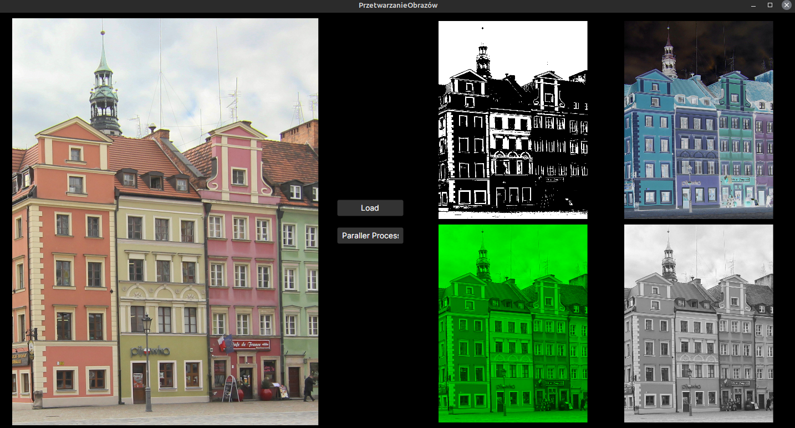

# Obliczenia Wielowątkowe w technologi .Net

##  Należało wykonać dwa zadania: 

-   Mnożenie Macierzy za pomocą biblioteki Parallel oraz za pomocą klasy Thread. Po czym porównanie wyników.
  - Wielowątkowe przetwarzanie obrazów.

## Mnożenie Macierzy

Wielowątkowość Mnożenia macierzy odbywa się po wierszach. 

Oto otrzymane wyniki: 
<table border="1">
  <thead>
    <tr>
      <th rowspan="2">Ilość</th>
      <th colspan="2">100</th>
      <th colspan="2">300</th>
      <th colspan="2">500</th>
      <th colspan="2">700</th>
    </tr>
    <tr>
      <th>Parallel</th>
      <th>Threads</th>
      <th>Parallel</th>
      <th>Threads</th>
      <th>Parallel</th>
      <th>Threads</th>
      <th>Parallel</th>
      <th>Threads</th>
    </tr>
  </thead>
  <tbody>
    <tr><td>1</td><td>6.8</td><td>5.9</td><td>128.7</td><td>125</td><td>555.3</td><td>562</td><td>1656.9</td><td>1685.6</td></tr>
    <tr><td>2</td><td>2.4</td><td>3.2</td><td>70.6</td><td>78.1</td><td>311.3</td><td>324.4</td><td>948.6</td><td>956.4</td></tr>
    <tr><td>3</td><td>1.9</td><td>2</td><td>57.2</td><td>62.4</td><td>239.6</td><td>273.6</td><td>642.8</td><td>722.3</td></tr>
    <tr><td>4</td><td>1.4</td><td>2</td><td>38</td><td>47.9</td><td>192.9</td><td>217.8</td><td>532.9</td><td>619.8</td></tr>
    <tr><td>5</td><td>1</td><td>1.5</td><td>34.1</td><td>41.1</td><td>156.7</td><td>192.4</td><td>471.9</td><td>545.6</td></tr>
    <tr><td>6</td><td>1</td><td>1.1</td><td>32.9</td><td>34</td><td>155.1</td><td>169.6</td><td>430.4</td><td>532.7</td></tr>
    <tr><td>7</td><td>1</td><td>1</td><td>28.3</td><td>29.9</td><td>125.7</td><td>145.7</td><td>403.5</td><td>469.6</td></tr>
    <tr><td>8</td><td>0.5</td><td>1.1</td><td>23.5</td><td>26</td><td>123.1</td><td>131.7</td><td>335</td><td>389.5</td></tr>
    <tr><td>9</td><td>0.3</td><td>1.1</td><td>23</td><td>23.3</td><td>107.5</td><td>118.4</td><td>313.9</td><td>355.3</td></tr>
    <tr><td>10</td><td>0.1</td><td>1</td><td>23.6</td><td>23.5</td><td>109.6</td><td>109.9</td><td>338</td><td>393.1</td></tr>
    <tr><td>11</td><td>0.1</td><td>1.2</td><td>20.7</td><td>21.3</td><td>101.5</td><td>102.8</td><td>300.5</td><td>314.3</td></tr>
    <tr><td>12</td><td>0.4</td><td>1.2</td><td>21.7</td><td>21.8</td><td>96.8</td><td>102.3</td><td>277.3</td><td>286.8</td></tr>
    <tr><td>13</td><td>0.3</td><td>1.3</td><td>19.9</td><td>20.4</td><td>117.3</td><td>118.3</td><td>263.5</td><td>273.5</td></tr>
    <tr><td>14</td><td>0.2</td><td>1.3</td><td>19.9</td><td>22.1</td><td>115.1</td><td>117.3</td><td>335.9</td><td>334.5</td></tr>
    <tr><td>15</td><td>0.3</td><td>1.3</td><td>25.2</td><td>27.4</td><td>94.8</td><td>96.2</td><td>267.9</td><td>279.7</td></tr>
    <tr><td>16</td><td>0.7</td><td>1.1</td><td>27.1</td><td>29</td><td>96.2</td><td>101.8</td><td>266.7</td><td>285.7</td></tr>
    <tr><td>17</td><td>0</td><td>1.4</td><td>26.6</td><td>30.5</td><td>96.6</td><td>104.4</td><td>277.1</td><td>295.2</td></tr>
    <tr><td>18</td><td>0.3</td><td>1.4</td><td>26.8</td><td>30.4</td><td>97.7</td><td>102.4</td><td>341.4</td><td>357.7</td></tr>
    <tr><td>19</td><td>0.1</td><td>1.4</td><td>27.9</td><td>28.3</td><td>95.6</td><td>101.2</td><td>272.4</td><td>286.9</td></tr>
    <tr><td>20</td><td>0</td><td>1.9</td><td>23.4</td><td>26</td><td>93.9</td><td>102</td><td>281</td><td>293.3</td></tr>
  </tbody>
</table>

Możemy zauważyć:

- Wykorzystanie klasy Threads jest wolniejsze od zastosowania biblioteki Parallel.
- Wraz z zwiększeniem rozmiaru macierzy wielowątkowość zaczyna przynosić lepsze rezultaty względem jednego wątku.
- Po około 12 wątkach wydajność wielowątkowości zaczyna spadać

## Przetwarzanie Obrazów

Zaimplementowano cztery operacje przetwarzania obrazu z użyciem biblioteki OpenCvSharp: 

-  Progowania
-  Konwersji do negatywu
-  Wyodrębnienie zielonej warstwy RGB
-  Konwersje obrazu do odcieni szarości

