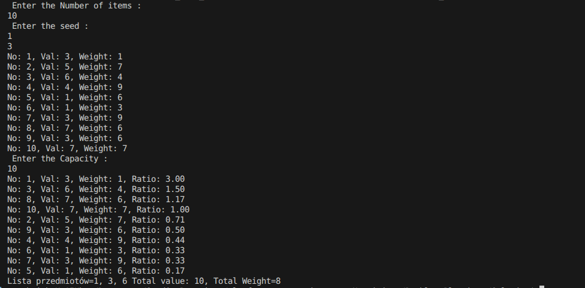
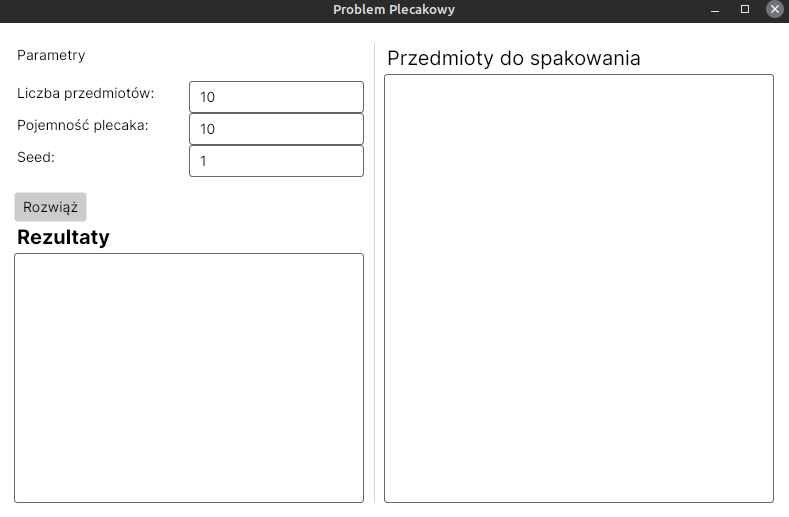
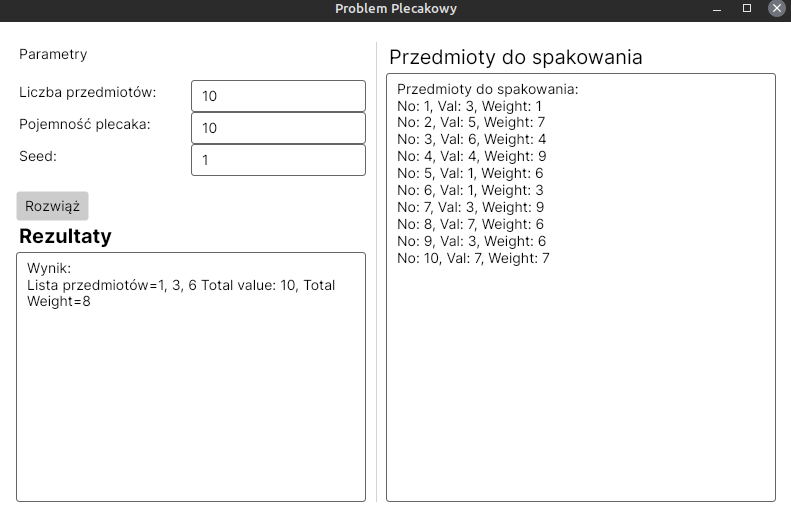
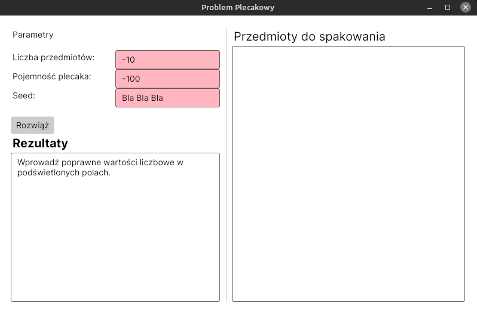

# Problem Plecakowy

## Jaki jest problem?

Wyobraźmy sobie plecak oraz przedmioty, które możemy do niego włożyć. Przedmioty mają swoją wagę i wartość. Chcemy, aby  w plecaku znalazły się przedmioty o jak największej wartości. Stosując algorytm zachłanny, gdzie sortujemy przedmioty po ich stosunku wartości do wagi otrzymamy wynik bliski optymalnemu.

## Struktura Rozwiązania - aplikacja konsolowa

Aplikacja konsolowa znajduje się w folderze Solution:

``` Item.cs ``` - zawiera definicje klasy przedmiotu

``` Problem.cs ``` - zawiera definicje klasy problemu, razem z metodą solve oraz przeciążoną metodę ToString().

``` Program.cs ``` - program właściwy aplikacji konsolowej. 

``` Result.cs ``` - zawiera definicję klasy rozwiązania oraz przeciążoną metodę ToString().


## Testy 

Zaimplementowano 6 testów jednostkowych :

- Sprawdzenie, czy zgadza się liczba zainicjalizowanych elementów.
- Sprawdzenie, czy jeśli co najmniej jeden przedmiot spełnia ograniczenia, to zwrócono co naj-
mniej jeden element.
- Sprawdzenie, czy jeśli żaden przedmiot nie spełnia ograniczeń, to zwrócono puste rozwiązanie.
- Sprawdzenie poprawności wyniku dla konkretnej instancji.
- Sprawdzwnie, czy jeśli przedmioty są za duże to zostanie zwrócona pusta lista.
- Sprawdzenie, czy jeśli zostanie podana negatywna liczba to zostanie zwrócony błąd.

## Aplikacja z GUI

Stworzona za pomocą Avalonia UI:





W przypadku próby rozwiązania z wpisanymi wartościami innymi niż liczba całkowita lub dla pojemności i ilości przedmiotów liczby mniejszej od zera - tło pól podświetli sie na czerwono:

